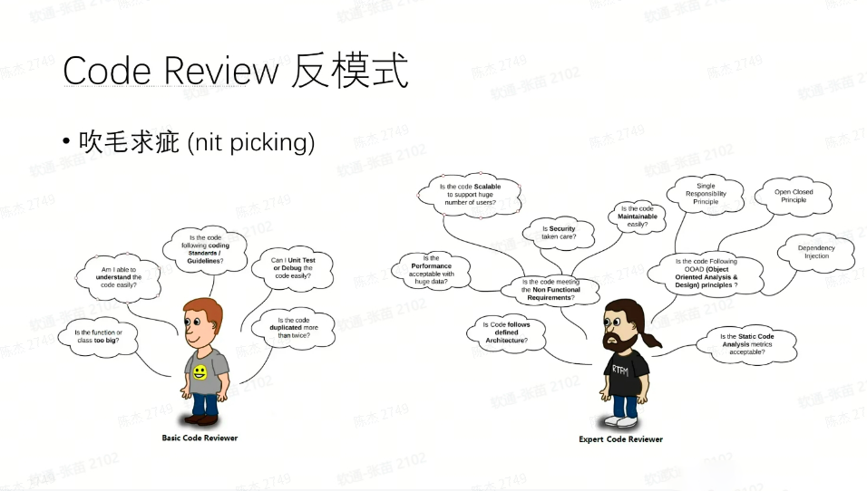

+++
title = 'Code Review 关注点及具体实践'
date = 2024-01-01T21:51:10+08:00

[cover]
hiddenInList = false
image = './posts/code-review-关注点及具体实践/images/Code%20Review%20Pyramid.png'
+++

## 什么是 Code Review？

> 代码审查是指对计算机源代码系统化地审查，常用软件同行评审的方式进行，其目的是在找出及修正在软件开发初期未发现的错误，提升软件质量及开发者的技术。 -- 维基百科

代码审查（Code Review）指一种通过复查代码来保证代码质量的过程。其主要发生在代码提交测试前，通过一个或多个人通过阅读部分代码来检查代码的质量。其中至少一人不得为该代码的编写者。

## 为什么要 Code Review？

尽管代码审查主要用于发现代码中的错误，但通常会附带以下其他目标：

* 更高质量的代码：提高代码的可读性及可维护性
* 查找缺陷逻辑：主要是代码逻辑外的问题，如性能问题，安全漏洞等
* 学习提高：帮助审查人员和作者相互交流解决方案，公共类库信息等
* 寻找更好的解决方案：集合多人的想法，产生更好的解决方案
* 增强团队责任感：提高团队成员间对代码的责任感，以及更好的合作意识
* 开发规范：帮助成员遵循开发规范

代码审查流程为代码的持续改进奠定了基础，并且也防止了不稳定代码的交付。

当然代码审查也存在以下问题：

* 更长的交付时间
* 消耗开发人员的注意力：导致开发人员的注意力在开发任务及审查任务间频繁切换
* 大量代码难以审查：对于大量代码的审查，审查人员会疲于代码的阅读，导致审查质量下降

## Code Review 的不同方式

Code Review的方式可以按照不同的目的和风格进行，以下是常见的三种方式：

### 守护把关式（gatekeeper）

代码审查者的主要角色是扮演一个严格的守门员，确保所有提交的代码符合团队的编码标准、质量要求。他们会检查代码的规范性、安全性、性能等方面，并提出必要的改进建议或拒绝不符合要求的代码。

### 知识分享式（knowledge sharing）

代码审查强调知识共享和团队成员之间的相互学习。审查者除了关注代码的质量和规范外，还鼓励作者解释其设计思路和算法选择，以及分享相关领域的知识。这样做有助于提高整个团队的技术水平和理解度。

### 征求意见式（early design feedback）

代码审查着重于征求审查者的意见和建议，作者视之为一个机会来获取反馈并提升自己的代码质量。审查者会提出问题、指出潜在的问题区域，并给予改进建议。这种方式也鼓励开放性的讨论和合作，促进团队成员之间的交流和互动。

## 具体要怎么做 Code Review

Code Review 根据提出意见后修改难易度分为五类

### 代码风格（Code Style）

* 是否应用项目的格式样式？
* 是否遵守团队的命名约定？
* 是否存在代码重复的问题？
* 代码可读性是否够高？

### 测试（Tests）

* 所有测试是否都通过？
* 新功能是否经过合理测试？
* 是否测试了极端情况？
* 是否尽可能使用单元测试，必要时使用集成测试？
* 是否有针对非功能需求的测试，例如代码性能？

### 文档（Documentation）

* 新功能是否有合理的记录？
* 是否涵盖所有相关类型的文档，例如自述文件、API 文档、用户指南、参考文档等？
* 文档是否易于理解并且没有明显的拼写错误和语法错误？

### 实现语义（Implementation Semantics）

* 是否满足原本要求？
* 逻辑是否正确？
* 是否存在不必要的复杂性？
* 是否健壮（没有并发问题、正确的错误处理等）？
* 性能是否足够好？
* 是否足够安全？例如 SQL 注入等问题
* 是否便于监测？例如指标、日志记录、数据跟踪等
* 是否存在没使用的依赖项？已使用的依赖项许可是否确认过？

### API语义（API Semantics）

* API 是否满足尽可能小，但可以根据需求扩大的原则？
* API 是否只有一种方法做一件事，而不是多种方法来做同一件事？
* API 是否一致，是否遵循最小惊讶原则（代码只需按照项目的要求来编写。其他华丽的功能就不必了，以免弄巧成拙。）？
* API/内部结构的干净区分，内部结构是否泄漏到 API 中？
* 面向用户的部分（API 类、配置、指标、日志格式等）是否没有重大变化？
* 新的 API 是否普遍有用且不会过于特定于单个用例？

## Code Review 中的错误实践

> Everyone cares about best practices, but worst practices can sometimes be more illuminating.

代码审查很重要，但是有时也会陷入错误的实践方式，比如以下几种：

### 吹毛求疵（nit picking）

过于关注代码细节和微小问题，从而忽视了整体质量和目标的审查行为
举例来说，代码作者投入了长时间的精力，考虑了多种设计方案，来创建他们认为最有效的解决方案。然后代码通过审查后得到的是针对提交代码样式不妥当的反馈。
尽管新代码与现有代码风格保持一致很重要，但这类问题基本不需要人工审阅。人工审阅的成本很高，使用人工审阅的目的是为了解决计算机无法完成的事情。检查新代码是否符合样式标准对于计算机是一件可以轻松完成的事情，让人工审阅关注这类问题只会偏离代码审查的真正目的

### 众口难调（inconsistent feedbacks）

团队成员花费不合理的时间和精力讨论琐碎的细节问题，而忽视了更重要的设计和功能方面的讨论
不同的人有不同的思考方式，提出不同的意见是再正常不过的事情。但是不能因此陷入抉择的陷阱。
我们常说没有一直以来最好的解决方案，只有当下最好的解决方案，几乎所有的设计问题都可以用“视情况而定”来回答，在这里我们也可以通过“当下最适合的解决方案”作为判定条件，在众多意见中选用解决方案。

### 石沉大海（ghost reviewers）

在代码审查过程中，提出的问题、建议或改进意见被忽视或无动于衷，没有得到适当的关注和跟进
常发生在大量代码审查，毕竟谁愿意费力阅读几十上百个更改文件呢？当代码审查不被当成实际工作或交付成果时，也会发生这类问题。还有就是困难或恶心的代码也会导致审查石沉大海，没有人会愿意去参与一项耗时且令人恶心的活动。

### 一举推翻（design changes when the code works）

审查人员试图完全改变或彻底重写作者的代码，而不是提供有针对性的意见和建议
这种情况常常是因为代码的底层设计出现失误，在提交代码的基础上提供意见已经没有意义，发生这种情况则代表着代码编写人员数天甚至数周的工作都浪费了
如果发生这种情况，团队应该考虑更新开发流程以更早地找到问题。结对编程或者与技术主管讨论解决方案都是很好的方式。

### 你来我往（ping pong review）

审查人员和作者之间陷入无休止的讨论和反复修改的循环，无法达成共识或解决问题
常发生在以下几种情况下：

* 审查没有明确的目的或可遵循的指导方针
* 审查人员过于挑剔且常常给出不同的审查意见
* 代码作者与审查人员缺少沟通，对审查人员提出意见没有完全理解

一旦发生这种情况，则需要第三方介入来打破这个循环，确定解决方案解决分歧，这通常是由高级开发人员、领导或架构师来完成

## 参考文献

* Code Review Best Practices <https://roadmap.sh/best-practices/code-review>

* 维基百科，Code_review <https://en.wikipedia.org/wiki/Code_review>

* Five Code Review Antipatterns <https://blogs.oracle.com/javamagazine/post/five-code-review-antipatterns>

* 为什么需要 Code Review <https://blog.csdn.net/qq_21086749/article/details/134171131>
