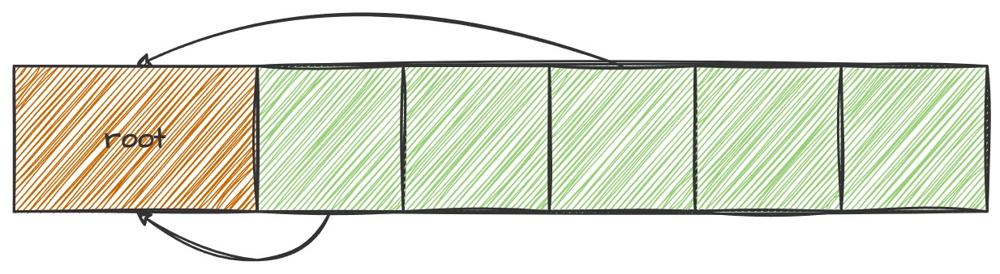
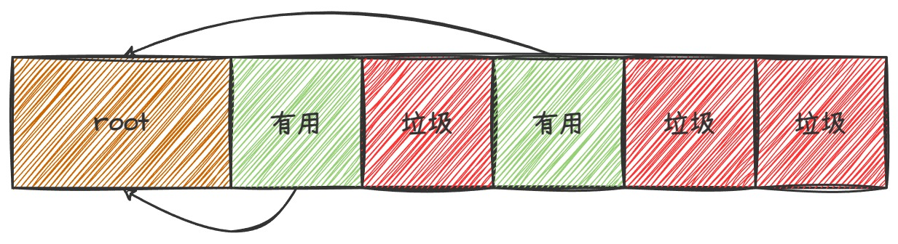
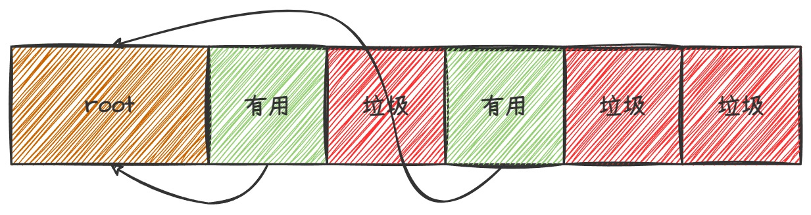
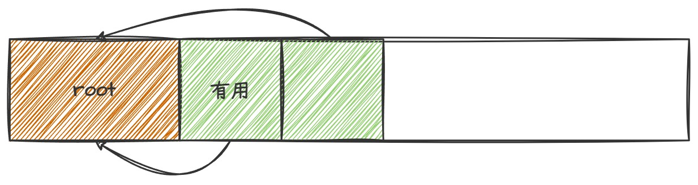
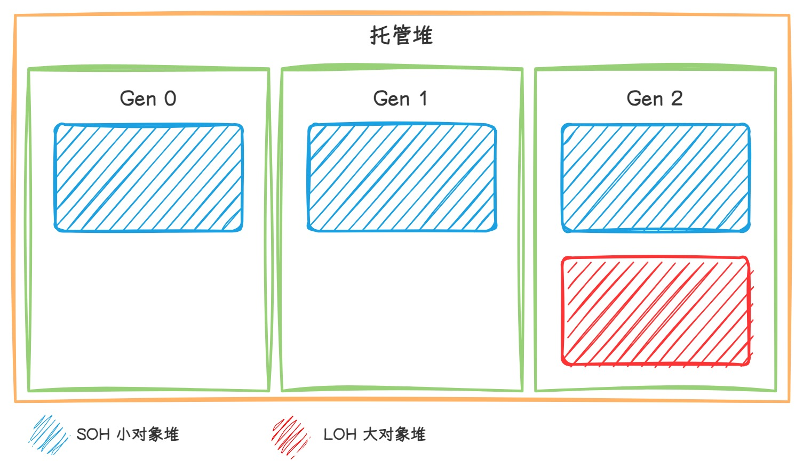
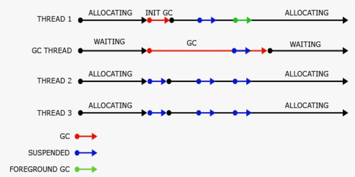

+++
date = 2025-02-03T20:11:23+08:00
draft = false
title = 'NET 垃圾回收机制（GC）'
+++

## 前言

内存管理在程序运行时的重要性不言而喻，.NET 下的 CLR 为托管代码提供了自动内存管理服务。通过 GC 管理着内存的分配和释放。

> 内存管理分手动及自动，.NET 采用的是自动内存管理。而象 C/C++ 这类语言则多采用手动内存管理。（由开发人员负责内存的分配和释放）

## GC 机制

GC 只负责托管资源的内存管理，非托管资源的内存管理则需要由开发人员手动操作。（通常经由 IDisposable 接口实现，也可重写 Object.Finalize() 方法。）

> CLR 初始化垃圾回收器后，会给每个**托管进程**分配内存用于存储和管理对象，进程中的所有线程都在该内存上为对象分配内存。此内存称为**托管堆**。  

### 区分活动对象

垃圾回收器通过使用以下信息来确定对象是否为活动对象：
* 堆栈根：由实时编译器 (JIT) 和堆栈查看器提供的堆栈变量。
* 垃圾回收句柄：指向托管对象且可由用户代码或公共语言运行时分配的句柄。
* 静态数据：应用程序域中可能引用其他对象的静态对象。

### GC 触发条件

当满足以下条件时触发 GC:

* 系统物理内存较低。
* 托管堆上已分配对象使用的内存超出了阈值。（该阈值为动态值，随进程运行不断调整）
* 调用 GC.Collect 方法。（主要用于测试及部分特殊情况）

### 垃圾回收过程

.NET 采用 **“标记-重定向-压缩”** 的方式对托管堆内存进行垃圾回收。  
在垃圾回收启动之前，除了触发垃圾回收的线程以外的所有托管线程均会挂起。

> 通常大对象不会轻易进行回收，因为其重定向损耗过大。


#### 标记

找到并创建所有活动对象的列表。CLR 从根对象出发，通过引用关系寻找到所有可到达对象。



> 根对象分四种：线程栈（thread stack），终结者队列（Finalize queue），GC 句柄表（GCHandles），跨代引用

标记阶段后，所有对象都被标记为**有用/垃圾**对象



#### 重定向

利用对象的标记信息进行模拟压缩，确定压缩方案。通过压缩方案更新对将要压缩的对象的在根对象上的引用信息。



#### 压缩

回收被清理对象占用的空间，并压缩幸存的对象。



## 内存分配

托管堆可分为小对象堆和大对象堆。对象大小不少于 85000 个字节的对象会被分配到大对象堆上，其余对象则分配到小对象堆。

> 进入大对象堆的对象大小阈值可通过添加 MSBuild 项。  
> 示例：runtimeconfig.json
> ``` json
>{
>   "runtimeOptions": {
>      "configProperties": {
>         "System.GC.LOHThreshold": 85000
>      }
>   }
>}
> ```

为优化垃圾回收器性能，又可将将托管堆分为三代：

* Generation 0：其中通常包含短生存期对象。例如临时变量。垃圾回收也最常在该代中发生。
* Generation 1：其中包含短生存期对象，并用作短生存期对象和长生存期对象之间的缓冲区。
* Generation 2：其中包含长生存期对象。例如静态变量。**大对象堆上的对象默认分配到这一代。**



垃圾回收中未被回收的对象将按以下逻辑分配：

* gen 0 垃圾回收中未被回收的的可访问对象将会升级至 gen 1。
* gen 1 垃圾回收中未被回收的的可访问对象将会升级至 gen 2。
* gen 1 垃圾回收中未被回收的的可访问对象**仍然**保留至 gen 2。

> gen 0，gen 1，gen 2的回收阈值并不是固定的，垃圾回收器会检测每代回收中对象的幸存率，根据幸存率分配该代的回收阈值。  
> CLR 会对以下两个优先级进行平衡：不允许通过延迟垃圾回收，使得占用内存过大，以及不允许垃圾回收过于频繁。

## GC的回收类型

GC 回收有两种类型，WorkStation GC(工作站)和Server GC(服务器)。工作站工作站垃圾回收是为客户端应用设计的，而服务器垃圾回收，用于需要高吞吐量和可伸缩性的服务器应用程序。

Server GC会拥有更大的内存，Server GC会为每个处理器创建一个用于执行垃圾回收的堆和专用线程，每个堆都拥有一个小对象堆和大对象堆，并且所有的堆都可以访问。 不同堆上的对象可以相互引用。因为多个垃圾回收线程一起工作，所以对于相同大小的堆Server GC垃圾回收比WorkStation GC垃圾回收更快一些。但是Server GC回收会占用大量资源，这种模式的特点是初始分配的内存较大，并且尽可能不回收内存,进行回收用时会很耗时,并进行内存碎片整理工作。

Workstation GC的内存相对于Server GC就很小啦，且它的回收线程就是服务的线程且有较高的优先级，因为必须与其他线程竞争 CPU 时间来进行回收。

可使用runtimeconfig.template.json文件和环境变量COMPlus_gcServer来配置。

COMPlus_gcServer 0 = WorkStation GC
COMPlus_gcServer 1 = Server GC

``` json
{
    "configProperties": {
        "System.GC.Server": true
        //true - Server GC  false - WorkStation GC
    }
}
```

**不同模式下的内存分配：**

|工作站/服务器 GC|32位|64位|
|---|---:|---:|
|工作站 GC|16 MB|256 MB|
|服务器 GC|64MB|4GB|
|服务器 GC（具有 > 4 个逻辑 CPU）|32M|2GB|
|服务器 GC（具有 > 8 个逻辑 CPU）|16M|1GB|

## GC的回收模式

GC有三种回收模式

* Non-Concurrent GC 非并行回收模式：在非并行模式下,回收时候会挂起所有其他的线程影响服务的性能。


* Concurrent GC 并行回收模式： 并行会后可以解决非并行回收引起的线程挂起，让其他线程和回收线程一起运行，使服务可以更快的响应，并行回收只会发生在Generation 2中，Generation 0/1始终都是非并发的，因为他们都是小对象回收的速度很快。在并行回收的时候我们依旧可以分配对象到Generation 0/1中。


* Background GC 后台回收模式：Background GC 是 Concurrent GC的增强版本。 区别在Background GC回收Generation 2的时允许了Generation 0/1 进行清理。在WorkStation GC下会使用一个专用的后台垃圾回收线程,而Server GC下会使用多个线程来进行回收。且Server GC下回收线程不会超时。

**工作站后台回收模式**


**服务器后台回收模式**


可使用runtimeconfig.json文件和环境变量COMPlus_gcConcurrent来配置。

COMPlus_gcConcurrent 0 =Non-Concurrent GC
COMPlus_gcConcurrent 1 =Background GC

``` json
{
    "configProperties": {
        "System.GC.Concurrent": true 
        //true- Background GC false -Non-Concurrent GC
    }  
}
```

## 参考文献

* 垃圾回收的基本知识 <https://learn.microsoft.com/zh-cn/dotnet/standard/garbage-collection/fundamentals>

* .Net Core 中GC的工作原理 <https://www.cnblogs.com/linhuiy/p/13183140.html>

* .NET Core GC标记阶段(mark_phase)底层原理浅谈 <https://www.cnblogs.com/lmy5215006/p/18657952>