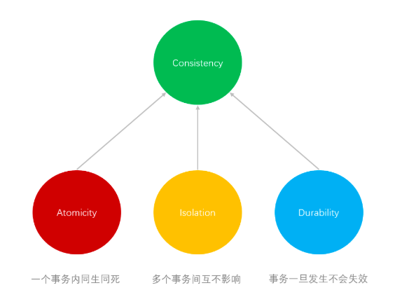
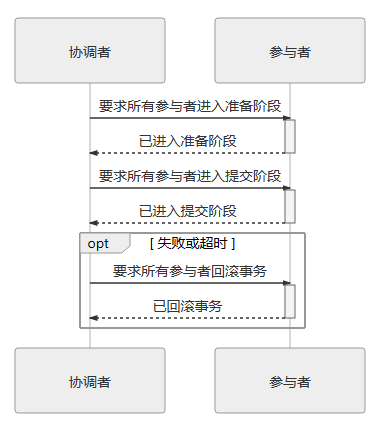
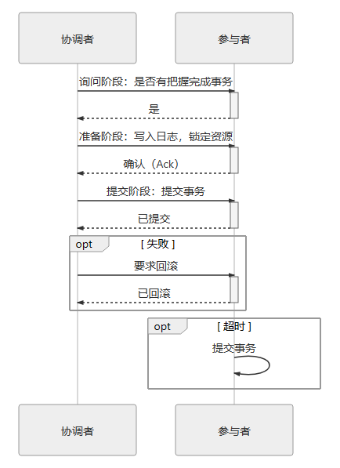
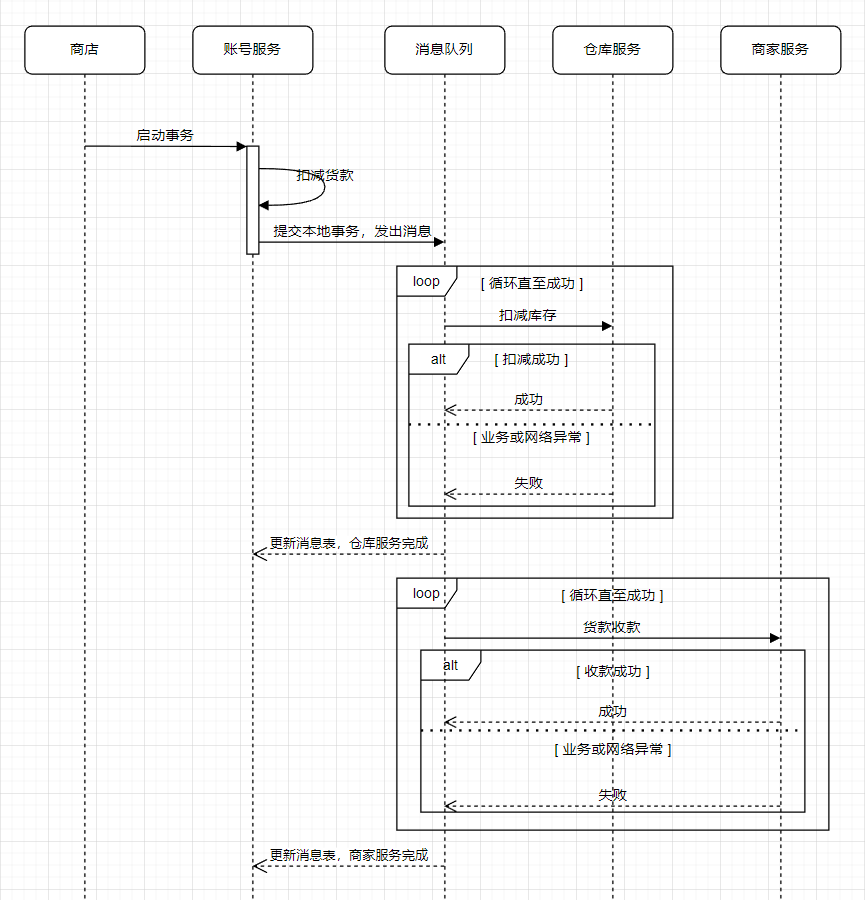

+++
title = '分布式事务简述'
date = 2023-12-02T21:51:10+08:00
draft = true
tags = ['tag1','tag2']
+++

# 分布式事务简述
> 分布式事务（Distributed Transaction）指多个服务同时访问多个数据源的事务处理机制。也可被称为“在分布式服务环境下的事务处理机制”。

## CAP 定理
> CAP 定理（Consistency、Availability、Partition Tolerance Theorem），在一个分布式系统中，当涉及共享数据问题时，CAP三特性最多只能同时满足其中两个。
> * 一致性（Consistency）：代表数据在任何时刻、任何分布式节点中所看到的都是符合预期的。
> * 可用性（Availability）：代表系统不间断提供服务的能力。可用性有两个相关指标：可靠性（Reliability）和可维护性（Serviceability）。可靠性使用平均无故障时间来度量；可维护性使用平均可修复时间来度量。可用性衡量系统可以正常使用的时间与总时间之比，即可用性是由可靠性和可维护性计算得出的比例值。
> * 分区容忍性（Partition Tolerance Theorem）：代表分布式环境中部分节点因网络原因而彼此失联后，系统仍能正确提供服务的能力。

那么按照CAP定理放弃三个特性中的一个时，会带来什么样的影响？
* 放弃分区容忍性（CA without P），则假设节点之间通信永远是可靠的。永远可靠的通信在分布式系统中必定不成立，只要使用网络来共享数据，网络故障导致的通信问题就会始终存在。
* 放弃可用性（CP without A），则一旦发生网络故障，节点之间的信息同步时间可以无限制地延长，我们可以通过 2PC/3PC 等手段，同时获得分区容忍性和一致性。选择放弃可用性的 CP 系统情况一般用于对数据质量要求很高的场合中，像银行、证券这些涉及金钱交易的服务，宁可中断也不能出错。
* 放弃一致性（AP without C），则一旦发生网络故障，节点之间提供的数据可能不一致。选择放弃一致性的 AP 系统目前是设计分布式系统的主流选择，因为 P 是分布式网络的天然属性，无法放弃；而 A 通常是建设分布式的目的。如果过可用性随着节点数量增加反而降低的话，很多分布式系统可能就失去了存在的价值。目前大多数 NoSQL 库和支持分布式缓存框架都是 AP 系统。
  
AP 系统作为目前设计分布式系统的主流选择时，允许数据在中间过程出错（不一致），但应该在输出时被修正过来。于是一致性被细分为“强一致性”和“弱一致性”。弱一致性中，稍微强一点的特例，被称为“最终一致性”（Eventual Consistency）。

## ACID
ACID 指本地事务应满足下述四个特性。
* 一致性（Consistency）：事务开始之前和事务结束以后，数据库的完整性没有被破坏。一致性既是事务的属性，也是事务的目的。
* 原子性（Atomicity）：一个事务中的所有操作，要么全部完成，要么全部不完成，不会在中间的某个环节结束。即，事务不可分割。
* 隔离性（Isolation）：一个事务内部的操作及使用的数据，对并发的其他事务是隔离的。隔离性可以防止多个事务并发执行时由于交叉执行而导致数据的不一致。事务隔离级别由弱至强分为未提交读（Read uncommitted）、提交读（Read committed）、可重复读（Repeatable read）和串行化（Serializable）。事务隔离级别越高，就越能保证数据的完整性和一致性，但同时对并发性能的影响也越大。
* 持久性（Durability）：事务处理结束后，对数据的修改应是永久的，即便系统故障也不会丢失。

原子性、隔离性、持久性是手段，一致性是目的，前者是因，后者是果

> ACID 中的一致性区别于 CAP 中的一致性
> ACID 中的一致性，是指单一实体内部的正确状态在时间维度上的一致性。因为是描述单一实体的内部状态，故又称“内部一致性”。
> CAP 中的一致性，是指在分布式系统中，空间维度上，某一特定时刻，多个实体中不同数据备份之间值的一致性，又称“外部一致性”。

通过日志实现事务的原子性和持久性是目前的主流方案，还有一种被称为影子分页的事务实现机制。常用的轻量级数据库 SQLite Version 3 采用的就是它。

## CP

放弃可用性的分布式事务解决方案

### 2PC

两段式提交（2 Phase Commit，2PC）：将提交拆分成两阶段过程：
* 准备阶段：又称投票阶段，在这一阶段，协调者询问事务的所有参与者是否准备好提交。这意味着在做完数据持久化后并不立即释放隔离性，即仍继续持有锁，以维持数据对其他非事务内观察者的隔离状态。

* 提交阶段：又称执行阶段，协调者如果在上一阶段确认所有参与者已准备好提交，则先自己在本地持久化事务状态为提交，完成后向所有参与者发送提交指令，所有参与者立即执行提交操作；否则，任意一个参与者回复未准备消息，或任意一个参与者超时未回复，协调者将自己的事务状态持久化为中止后，向所有参与者发送中止指令，参与者立即执行回滚操作。
  
两段式提交能够成功保证一致性还需要一些其他前提条件。
* 网络在提交阶段的短时间内是可靠的，即提交阶段不会丢失消息。网络通信在全过程都不会出现误差，即可以丢失消息，但不会传递错误消息。
* 因为网络故障、机器崩溃或者其他原因而导致失联的节点最终能够恢复，不会永久性地处于失联状态。

协调者、参与者都是可以由数据库自己来扮演的，不需要应用程序介入。
协调者一般是在参与者之间选举产生的，而应用程序相对于数据库来说只扮演客户端的角色。

两段式提交优点原理简单易实现，但有几个非常显著的缺点：
* 单点问题：两段式提交中对于协调者等待参与者回复可以有超时机制，允许参与者宕机，但参与者等待协调者指令时无法做超时处理。一旦协调者宕机，所有参与者都会受到影响。如果协调者一直没有恢复，那所有参与者都必须一直等待。
* 性能问题：两段式提交过程中，所有参与者相当于被绑定成为一个统一调度的整体，整个过程将持续到参与者集群中最慢的那一个处理操作结束为止，这决定了两段式提交的性能通常都较差。
* 一致性风险：尽管提交阶段时间很短，但这仍是一段明确存在的危险期，如果协调者提交本地事务后，向所有参与者发出提交指令时，因为网络故障导致部分参于者未接收到指令，就会使得部分数据（协调者）已提交，但部分数据（参与者）即未提交，也没有办法回滚，产生了数据不一致的问题。

为缓解两段式提交协议的一部分缺陷，具体地说是协调者的单点问题和准备阶段的性能问题，后续又发展出了“三段式提交”（3 Phase Commit，3PC）

### 3PC

三段式提交（3 Phase Commit，3PC）：将原本的两段式提交的准备阶段细分为两个阶段，分别称为 CanCommit、PreCommit，把提交阶段改称为 DoCommit 阶段。
* CanCommit：询问阶段，协调者让每个参与的数据库根据自身状态，评估该事务是否有可能顺利完成。
* PreCommit：准备阶段，与二段式提交协议准备阶段相同。
* DoCommit：提交阶段，与二段式提交协议提交阶段相同

拆分二段式提交协议准备阶段的理由是，一旦协调者发出开始准备的消息，每个参与者都将开始写重做日志，所涉及的数据资源即将被锁住，如果此时某一个参与者宣告无法完成提交，相当于大家都白做了一轮无用功。所以增加一轮询问阶段，如果都得到了正面的响应，那事务成功提交的把握就更大了，参与者发生崩溃而导致大家全部回滚的风险就会相对变小。因此，当事务需要回滚时，三段式的性能通常是要比两段式更好，但在事务能够正常提交的场景下，两者的性能都依然很差，甚至三段式因为多了一次询问，还要更差一些。

由于事务失败回滚的几率变小的原因，在三段式提交中，如果在 PreCommit 阶段之后发生了协调者宕机，即参与者没有等到 DoCommit 的消息的话，默认的操作策略将是提交事务而不是回滚事务或者持续等待，这就相当于避免了协调者单点问题的风险。

三段式提交虽然对单点问题和回滚时的性能问题有所改善，但是它对一致性风险问题并未有任何改进，在这方面它面临的风险甚至反而略有增加。例如，进入 PreCommit 阶段之后，协调者发出的指令不是 Ack 而是 Abort，而此时因网络问题，有部分参与者直至超时都未能收到协调者的 Abort 指令的话，这些参与者将会错误地提交事务，导致了不同参与者之间数据不一致地问题。

## AP

放弃强一致性的分布式事务，达成最终一致性的解决方案。

### 可靠事件队列

依靠持续重试来保证可靠性的解决方案，叫做“最大努力交付”
可靠事件队列还有一种更普通的形式，被称为“最大努力一次交付”，指的就是将最有可能出错的业务以本地事务的方式完成后，采用不断重试的方式来促使同一个分布式事务中的其他关联业务全部完成

### TCC 事务

可靠事件队列虽然能保证最终额结果是相对可靠的，过程也足够简单（相对于 TCC 来说），但整个过程完全没有任何隔离性而言。例如在示例中，缺乏隔离性带来的问题便是“超售”：两个客户短时间内都成功购买了同一件商品，而且他们各自购买的数量都不超过目前的库存，但他们购买的数量之和却超过了库存。如果是在刚性事务下，且隔离级别足够的情况下是可以完全避免的。但使用可靠消息队列就无法保证这一点。而 TCC 方案天生适合用于需要强隔离性的分布式事务中。

TCC 是一种业务侵入式较强的事务方案，要求业务处理过程必须拆分为“预留业务资源”和“确认/释放消费资源”两个子过程。
TCC 分为以下三个阶段：
* Try：尝试执行阶段，完成所有业务可执行性的检查（保障一致性），并且预留好全部需用到的业务资源（保障隔离性）。
* Confirm：确认执行阶段，不进行任何业务检查，直接使用 Try 阶段准备的资源来完成业务处理。Conirm 阶段可能会重复执行，因此本阶段所执行的操作需要具备幂等性。
* Cancel：取消执行阶段，释放 Try 阶段预留的业务资源。Cancel 阶段可能会重复执行，也需要满足幂等性。

#### TCC 的优缺点
TCC 有点类似 2PC 的准备阶段和提交阶段，但 TCC 是位于用户代码层面，而不是在基础设施层面，这为它额实现带来了较高的灵活性，可以根据需要设计资源锁定的粒度。
TCC 在业务执行时只操作预留资源，几乎不会涉及锁和资源的争用，具有很高的性能潜力。
但 TCC 带来了更高的开发成本和业务入侵性，意味着有更高的开发成本和更换事务实现方案的替换成本。

### SAGA 事务

SAGA 事务模式：将一个分布式环境下的大事务分解为一系列本地事务的设计模式
SAGA 由两部分操作组成
* 大事务拆分成若干个小事务，每个子事务都应该是或者能被视为是原子行为。
* 为每一个子事务设计对应的补偿动作。

子事务和对应的补偿动作必须满足以下条件：
* 都具备幂等性
* 满足交换律，即执行顺序不影响结果
* 补偿动作必须能成功提交，不考虑提交失败回滚的情形，如出现则必须持续重试至成功

若事务失败，则要采取以下两种恢复策略之一：
* 正向恢复：如果子事务提交失败，则一直对该事务进行重试，直至成功为止（最大努力交付）
* 反向恢复：如果子事务提交失败，则一直执行对该事务对应的补偿，直至成功为止（最大努力交付）

与 TCC 相比，SAGA 不需要为资源设计冻结状态和撤销冻结额操作，补偿操作往往要比冻结操作容易实现的多。
SAGA 必须保证所有子事务都得以提交或者补偿，但 SAGA 系统本身也有可能会崩溃，所以它必须设计成与数据库类似的日志机制以保证系统恢复后可以追踪到子事务的执行情况。

## 参考文献
* 凤凰架构，事务处理
  http://icyfenix.cn/architect-perspective/general-architecture/transaction/
* 维基百科，ACID
  https://zh.wikipedia.org/wiki/ACID
* 深入理解大数据架构之——事务及其ACID特性
  https://www.cnblogs.com/cciejh/p/acid.html#%E5%8E%9F%E5%AD%90%E6%80%A7atomicity