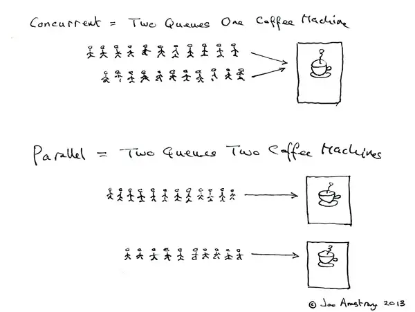

+++
title = '并发编程中的误解'
date = 2025-01-02T00:00:00+08:00
draft = true
+++

## [错误] 并发就是多线程

> 并发 != 多线程

多线程是一种采用多个执行线程的并发形式。

## [错误] 并发与并行相同

并发：多个线程被（一个） CPU 轮流切换着执行
并行：多个线程同时被（多个） CPU 执行

## [错误] 并发总能改善性能

当并发需要频繁切换上下文时，可能会存在切换上下文的开销大于上下文运行所需的开销，反而不如单线程运行。

## [错误] 异步就是多线程

多线程：一种采用多个执行线程的并发形式。
异步编程：一种通过 future 或回调类规避多余线程的并发形式。

两者同为并发形式的一种，但异步侧重于任务的执行顺序，而多线程则是关于多个线程如何并发执行。
与异步相对的概念是同步
与多线程相对的概念是单线程
